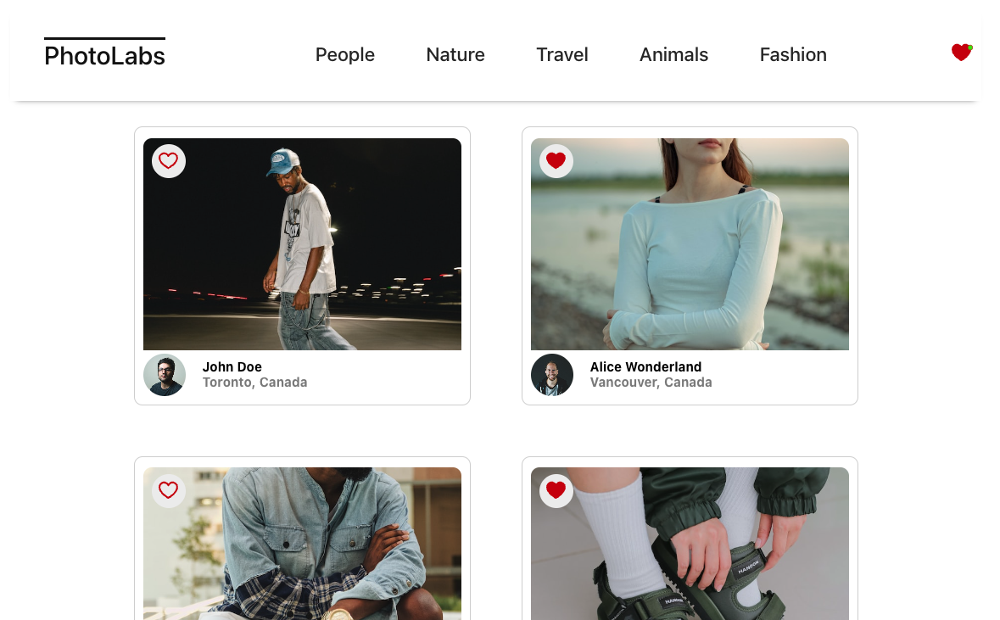
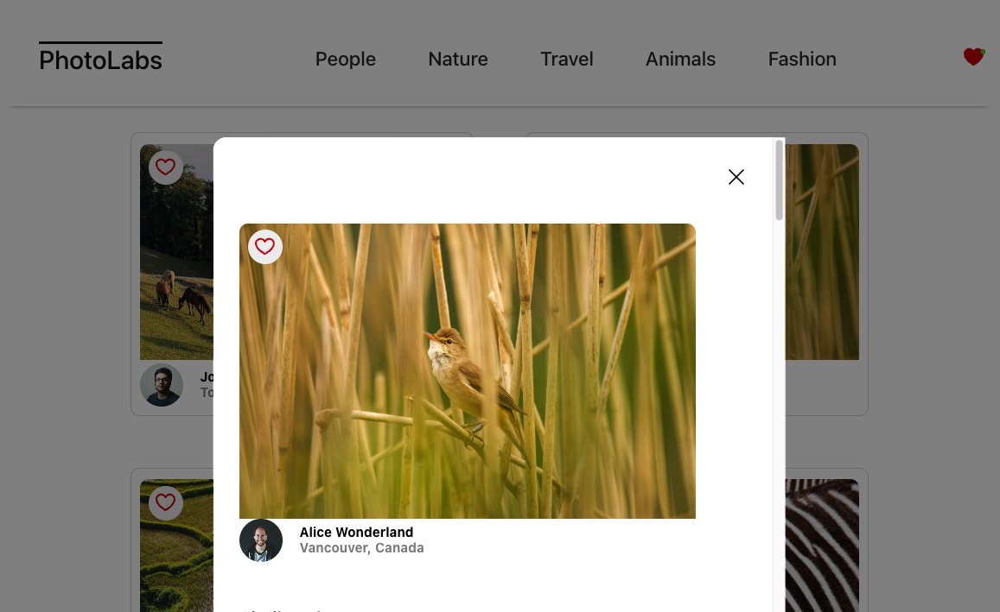
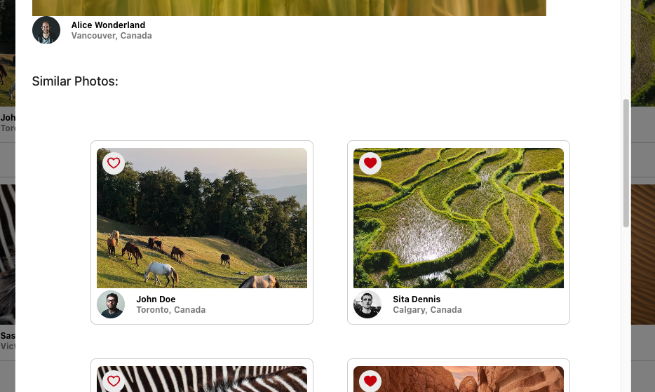

# react-photolabs
The PhotoLabs project for the Web Development React course programming.

# Photolabs


HomePage shows all the photos and can be filtered by Topic. Also in the Navigation Bar there is an icon to show you when you have any favourites selected.




A modal pops-up when you click on any image.




You can see similar images within the modal and also have the ability to select those as favourites there aswell.


## Setup

Install dependencies with `npm install` in each respective `/frontend` and `/backend`.

## [Frontend] Running Webpack Development Server

```sh
cd frontend
npm start
```

## [Backend] Running Backend Servier

Read `backend/readme` for further setup details.

```sh
cd backend
npm start
```
